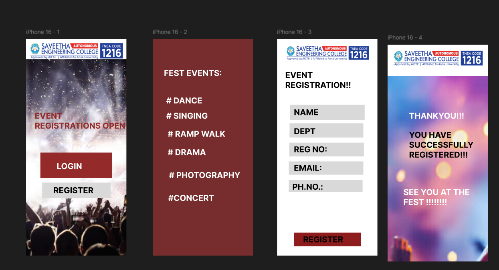

# Ex09 Event Registration Web Application
## Date:4.6.26

## AIM:
To design, develop and deploy a web application for event registration.

## DESIGN STEPS:

### Step 1:
Create a new frame.

### Step 2:
Select any one preset size of your choice.

### Step 3:
Select the shapes you need.

### Step 4:
Import images as needed.

### Step 5:
Create pages based on your need and link them.

### Step 6:

Validate the HTML and CSS code.

### Step 6:

Publish the website in the given URL.

## DESIGN TOOL:
Figma

## CODE:
```
<!DOCTYPE html>
<html>
<head>
<meta name="viewport" content="width=device-width, initial-scale=1"/>
<meta charset="utf-8" />
<link rel="stylesheet" href="globals.css">
<link rel="stylesheet" href="style.css">
</head>
<body>
<div class="iphone" >

<div class="text-wrapper" >EVENT REGISTRATIONS OPEN</div>

<div class="div" ></div>
<div class="text-wrapper-2" >LOGIN</div>

<div class="text-wrapper-3" >REGISTER</div></div>
</body>
</html>
.iphone {
  background-color: #ffffff;
  overflow: hidden;
  width: 100%;
  min-width: 393px;
  min-height: 852px;
  position: relative;
}

.iphone .logos {
  position: absolute;
  top: 14px;
  left: 9px;
  width: 375px;
  height: 73px;
  aspect-ratio: 5.13;
  object-fit: cover;
}

.iphone .event {
  position: absolute;
  top: 80px;
  left: 0;
  width: 393px;
  height: 772px;
  aspect-ratio: 0.67;
}

.iphone .text-wrapper {
  position: absolute;
  top: 283px;
  left: 34px;
  width: 359px;
  font-family: "Inter-Bold", Helvetica;
  font-weight: 700;
  color: #932a2a;
  font-size: 32px;
  letter-spacing: 0;
  line-height: normal;
}

.iphone .rectangle {
  position: absolute;
  top: 404px;
  left: -176px;
  width: 194px;
  height: 67px;
}

.iphone .div {
  position: absolute;
  top: 447px;
  left: 56px;
  width: 281px;
  height: 100px;
  background-color: #932a2a;
}

.iphone .text-wrapper-2 {
  position: absolute;
  top: 481px;
  left: 120px;
  font-family: "Inter-Bold", Helvetica;
  font-weight: 700;
  color: #ffffff;
  font-size: 32px;
  letter-spacing: 0;
  line-height: normal;
}

.iphone .img {
  position: absolute;
  top: 565px;
  left: 63px;
  width: 268px;
  height: 61px;
}

.iphone .text-wrapper-3 {
  position: absolute;
  top: 576px;
  left: 107px;
  font-family: "Inter-Bold", Helvetica;
  font-weight: 700;
  color: #000000;
  font-size: 32px;
  letter-spacing: 0;
  line-height: normal;
}
<!DOCTYPE html>
<html>
<head>
<meta name="viewport" content="width=device-width, initial-scale=1"/>
<meta charset="utf-8" />
<link rel="stylesheet" href="globals.css">
<link rel="stylesheet" href="style.css">
</head>
<body>
<div class="iphone" ><div class="text-wrapper" >FEST EVENTS:</div>
<div class="div" ># DANCE</div>
<div class="text-wrapper-2" ># SINGING</div>
<div class="text-wrapper-3" ># RAMP WALK</div>
<div class="text-wrapper-4" ># DRAMA</div>
<div class="text-wrapper-5" ># PHOTOGRAPHY</div>
<div class="text-wrapper-6" >#CONCERT</div></div>
</body>
</html>
.iphone {
  background-color: #762d2d;
  width: 100%;
  min-width: 393px;
  min-height: 852px;
  display: flex;
  flex-direction: column;
}

.iphone .text-wrapper {
  margin-left: 43px;
  width: 300px;
  height: 78px;
  margin-top: 115px;
  font-family: "Inter-Bold", Helvetica;
  font-weight: 700;
  color: #ffffff;
  font-size: 32px;
  letter-spacing: 0;
  line-height: normal;
}

.iphone .div {
  margin-left: 52px;
  width: 226px;
  height: 33px;
  margin-top: 30px;
  font-family: "Inter-Bold", Helvetica;
  font-weight: 700;
  color: #fffdfd;
  font-size: 32px;
  letter-spacing: 0;
  line-height: normal;
  white-space: nowrap;
}

.iphone .text-wrapper-2 {
  margin-left: 52px;
  width: 179px;
  height: 46px;
  margin-top: 27px;
  font-family: "Inter-Bold", Helvetica;
  font-weight: 700;
  color: #ffffff;
  font-size: 32px;
  letter-spacing: 0;
  line-height: normal;
}

.iphone .text-wrapper-3 {
  margin-left: 58px;
  width: 248px;
  height: 55px;
  margin-top: 25px;
  font-family: "Inter-Bold", Helvetica;
  font-weight: 700;
  color: #ffffff;
  font-size: 32px;
  letter-spacing: 0;
  line-height: normal;
}

.iphone .text-wrapper-4 {
  margin-left: 58px;
  width: 229px;
  height: 44px;
  margin-top: 17px;
  font-family: "Inter-Bold", Helvetica;
  font-weight: 700;
  color: #ffffff;
  font-size: 32px;
  letter-spacing: 0;
  line-height: normal;
}

.iphone .text-wrapper-5 {
  margin-left: 63px;
  width: 280px;
  height: 57px;
  margin-top: 46px;
  font-family: "Inter-Bold", Helvetica;
  font-weight: 700;
  color: #ffffff;
  font-size: 32px;
  letter-spacing: 0;
  line-height: normal;
}

.iphone .text-wrapper-6 {
  margin-left: 60px;
  width: 261px;
  height: 56px;
  margin-top: 33px;
  font-family: "Inter-Bold", Helvetica;
  font-weight: 700;
  color: #ffffff;
  font-size: 32px;
  letter-spacing: 0;
  line-height: normal;
}
<!DOCTYPE html>
<html>
<head>
<meta name="viewport" content="width=device-width, initial-scale=1"/>
<meta charset="utf-8" />
<link rel="stylesheet" href="globals.css">
<link rel="stylesheet" href="style.css">
</head>
<body>
<div class="iphone" >
<div class="text-wrapper" >EVENT REGISTRATION!!</div>
<div class="rectangle" ></div>
<div class="div" >NAME</div>
<div class="rectangle-2" ></div>
<div class="text-wrapper-2" >DEPT</div>
<div class="rectangle-3" ></div>
<div class="text-wrapper-3" >REG NO:</div>
<div class="rectangle-4" ></div>
<div class="text-wrapper-4" >EMAIL:</div>
<div class="rectangle-5" ></div>
<div class="text-wrapper-5" >PH.NO.:</div>
<div class="rectangle-6" ></div>
<div class="text-wrapper-6" >REGISTER</div></div>
</body>
</html>
.iphone {
  background-color: #ffffff;
  width: 100%;
  min-width: 393px;
  min-height: 852px;
  position: relative;
}

.iphone .logos {
  position: absolute;
  top: 26px;
  left: 30px;
  width: 334px;
  height: 65px;
  aspect-ratio: 5.13;
  object-fit: cover;
}

.iphone .text-wrapper {
  position: absolute;
  top: 123px;
  left: 32px;
  width: 323px;
  font-family: "Inter-Bold", Helvetica;
  font-weight: 700;
  color: #000000;
  font-size: 32px;
  letter-spacing: 0;
  line-height: normal;
}

.iphone .rectangle {
  position: absolute;
  top: 259px;
  left: 51px;
  width: 292px;
  height: 60px;
  background-color: #d9d9d9;
}

.iphone .div {
  position: absolute;
  top: 269px;
  left: 66px;
  font-family: "Inter-Bold", Helvetica;
  font-weight: 700;
  color: #000000;
  font-size: 32px;
  letter-spacing: 0;
  line-height: normal;
}

.iphone .rectangle-2 {
  position: absolute;
  top: 332px;
  left: 49px;
  width: 289px;
  height: 56px;
  background-color: #d9d9d9;
}

.iphone .text-wrapper-2 {
  position: absolute;
  top: 344px;
  left: 66px;
  font-family: "Inter-Bold", Helvetica;
  font-weight: 700;
  color: #000000;
  font-size: 32px;
  letter-spacing: 0;
  line-height: normal;
}

.iphone .rectangle-3 {
  position: absolute;
  top: 408px;
  left: 48px;
  width: 292px;
  height: 54px;
  background-color: #d9d9d9;
}

.iphone .text-wrapper-3 {
  position: absolute;
  top: 415px;
  left: 66px;
  font-family: "Inter-Bold", Helvetica;
  font-weight: 700;
  color: #000000;
  font-size: 32px;
  letter-spacing: 0;
  line-height: normal;
}

.iphone .rectangle-4 {
  position: absolute;
  top: 482px;
  left: 46px;
  width: 292px;
  height: 52px;
  background-color: #d9d9d9;
}

.iphone .text-wrapper-4 {
  position: absolute;
  top: 488px;
  left: 66px;
  font-family: "Inter-Bold", Helvetica;
  font-weight: 700;
  color: #000000;
  font-size: 32px;
  letter-spacing: 0;
  line-height: normal;
}

.iphone .rectangle-5 {
  position: absolute;
  top: 554px;
  left: 46px;
  width: 289px;
  height: 48px;
  background-color: #d9d9d9;
}

.iphone .text-wrapper-5 {
  position: absolute;
  top: 562px;
  left: 60px;
  font-family: "Inter-Bold", Helvetica;
  font-weight: 700;
  color: #000000;
  font-size: 32px;
  letter-spacing: 0;
  line-height: normal;
}

.iphone .rectangle-6 {
  position: absolute;
  top: 762px;
  left: 66px;
  width: 262px;
  height: 53px;
  background-color: #8e1c1c;
}

.iphone .text-wrapper-6 {
  position: absolute;
  top: 769px;
  left: 102px;
  font-family: "Inter-Bold", Helvetica;
  font-weight: 700;
  color: #000000;
  font-size: 32px;
  letter-spacing: 0;
  line-height: normal;
}
<!DOCTYPE html>
<html>
<head>
<meta name="viewport" content="width=device-width, initial-scale=1"/>
<meta charset="utf-8" />
<link rel="stylesheet" href="globals.css">
<link rel="stylesheet" href="style.css">
</head>
<body>
<div class="iphone" >

<div class="text-wrapper" >THANKYOU!!!</div>
<div class="div" >YOU HAVE SUCCESSFULLY REGISTERED!!!</div>
<p class="p" >SEE YOU AT THE FEST !!!!!!!!</p></div>
</body>
</html>
.iphone {
  background-color: #ffffff;
  overflow: hidden;
  width: 100%;
  min-width: 393px;
  min-height: 852px;
  position: relative;
}

.iphone .logos {
  position: absolute;
  top: 21px;
  left: 17px;
  width: 360px;
  height: 70px;
  aspect-ratio: 5.13;
  object-fit: cover;
}

.iphone .even {
  position: absolute;
  top: 124px;
  left: 0;
  width: 393px;
  height: 728px;
  aspect-ratio: 1.56;
  object-fit: cover;
}

.iphone .text-wrapper {
  position: absolute;
  top: 260px;
  left: 84px;
  width: 251px;
  font-family: "Inter-Bold", Helvetica;
  font-weight: 700;
  color: #ffffff;
  font-size: 32px;
  letter-spacing: 0;
  line-height: normal;
}

.iphone .div {
  position: absolute;
  top: 335px;
  left: 84px;
  width: 355px;
  font-family: "Inter-Bold", Helvetica;
  font-weight: 700;
  color: #000000;
  font-size: 32px;
  letter-spacing: 0;
  line-height: normal;
}

.iphone .p {
  position: absolute;
  top: 560px;
  left: 62px;
  width: 294px;
  font-family: "Inter-Bold", Helvetica;
  font-weight: 700;
  color: #ffffff;
  font-size: 32px;
  letter-spacing: 0;
  line-height: normal;
}
```
## OUTPUT:


## RESULT:
The program to design, develop and deploy a web application for event registration is completed successfully.
